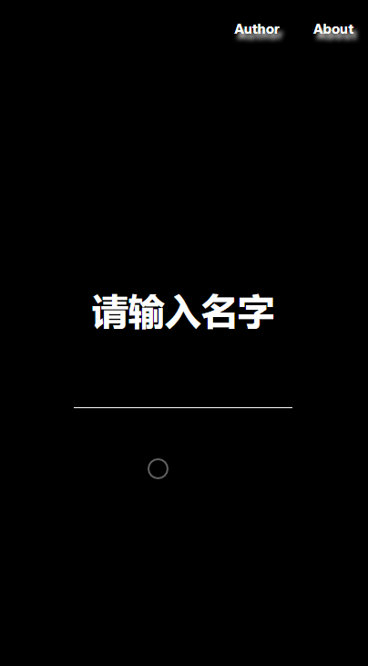

# Vue-talk

> 多人在线/AI聊天项目

## 简介
技术栈：
* Vue三剑客： Vue单文件组件，Vue-router路由管理，Vuex状态管理
* Axios：发送请求
* Socket.io：双向通信
* 图灵机器人： 自娱自乐0_0
* 百度地图API：提供定位

为什么写这个项目？
1. 接触了Socket.io官网，发现Demo的聊天室很有趣。
2. 正好在学习Vue，感觉可以与其结合起来完成有趣的东西。
3. 是在Gayhub上搜索相关项目，正好找到了类似想法的Vue-chat项目，于是参考了其设计方案。

## 效果


## Build Setup

``` bash
# install dependencies
npm install

# serve with hot reload at localhost:8080
npm run dev

# build for production with minification
npm run build

# build for production and view the bundle analyzer report
npm run build --report
```

For detailed explanation on how things work, checkout the [guide](http://vuejs-templates.github.io/webpack/) and [docs for vue-loader](http://vuejs.github.io/vue-loader).
